## Purpose

The purpose of this sample is to show how leverage OKTA as a SAML SSO provider for MicroStrategy Web

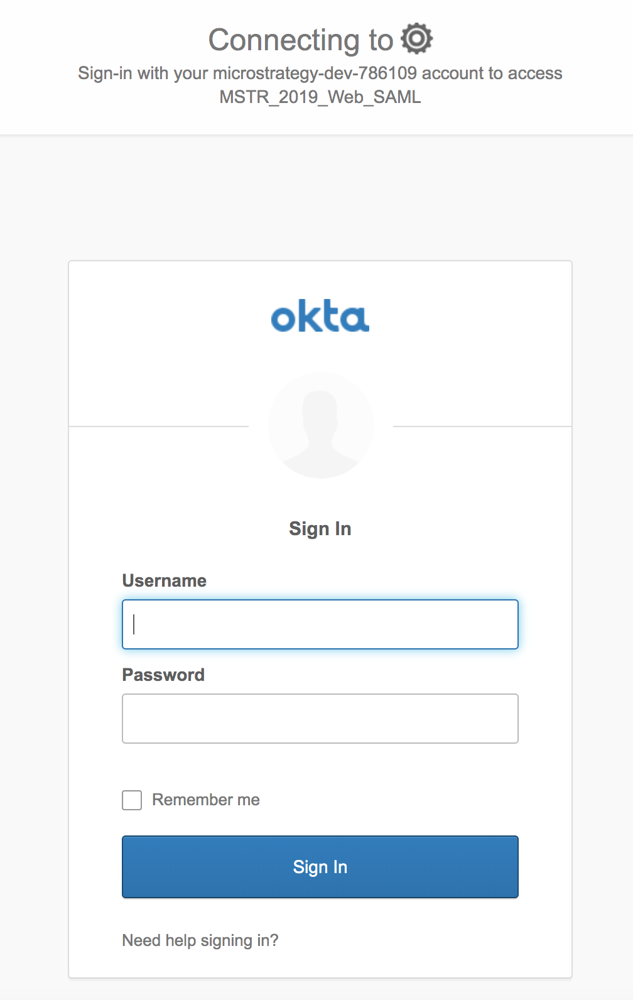

## Setup

### Generate SAML Config files for MicroStrategy Web

1.	Open the saml config page within your MicroStrategy Library application:
 `http(s)://<FQDN>:<port>/<MicroStrategyLibrary>/saml/config/open`
 
2)	Specify an Entity ID that is unique to your application. For this example we will use the entity `2019Entity`

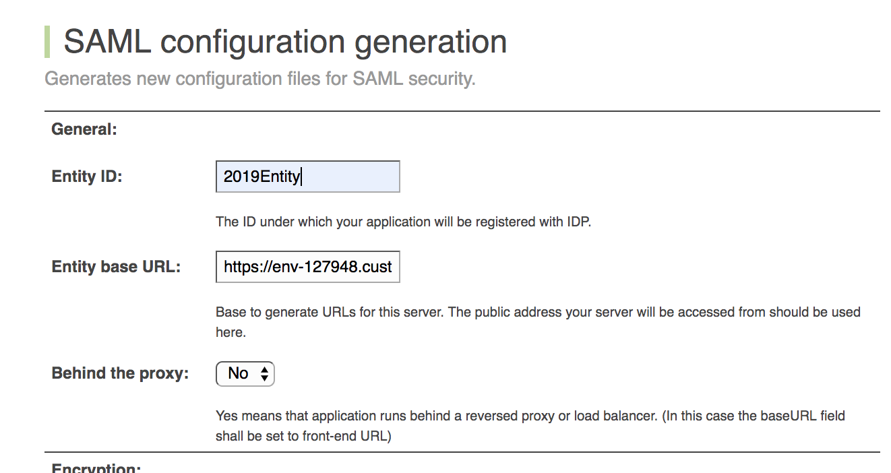

3)	For the Assertion Attribute mapping, ensure the values match what will be provided by the IDP. In this example with OKTA, there is no need to change any of these values for a simple prototype. 

4)	Click `Generate config` on the bottom of the page.

This will generate a number of files within the web application at the path:
`../WEB-INF/classes/resources/SAML/`

### Setup OKTA as IDP

1)	Sign into Okta

2)	Go to the Admin page 

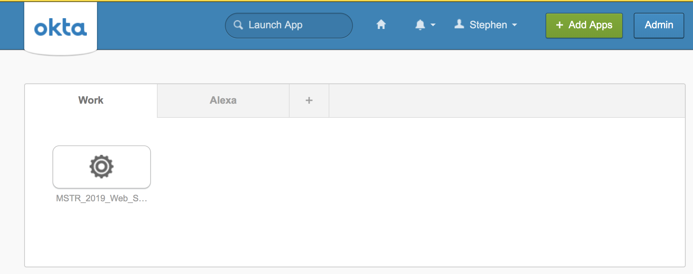

3)	Select `Classic UI’

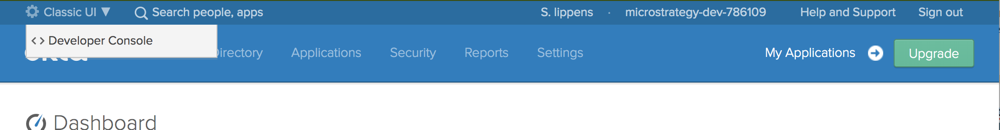

4)	Click on `Applications`

5)	Click `Create New App’ and choose a SAML 2.0 application

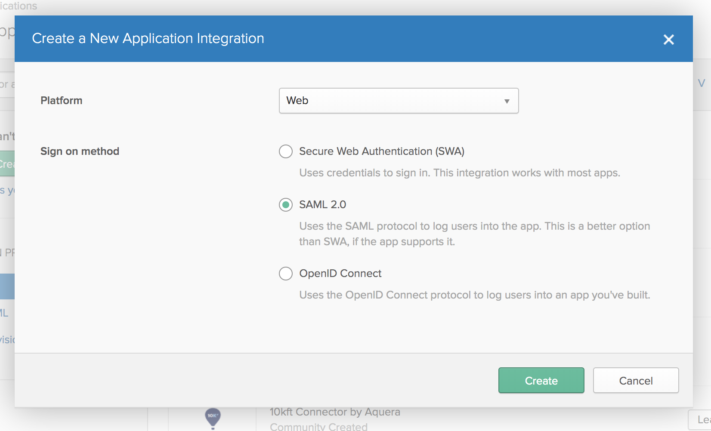

6) Open the SPMetadata.XML file generated within your MicroStrategy Web application at the path `../WEB-INF/classes/resources/SAML/` and locate the SSO URL defined as the 'HTTP-POST' Binding value. It should be a URL ending in `/SSO`

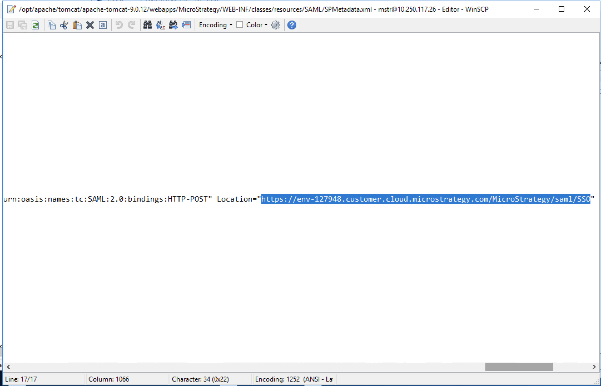

7) Provide this URL as the `Single sign on URL` value for OKTA

8) Provide the Entity ID you assigned MicroStrategy. In our example it is `2019Entity`

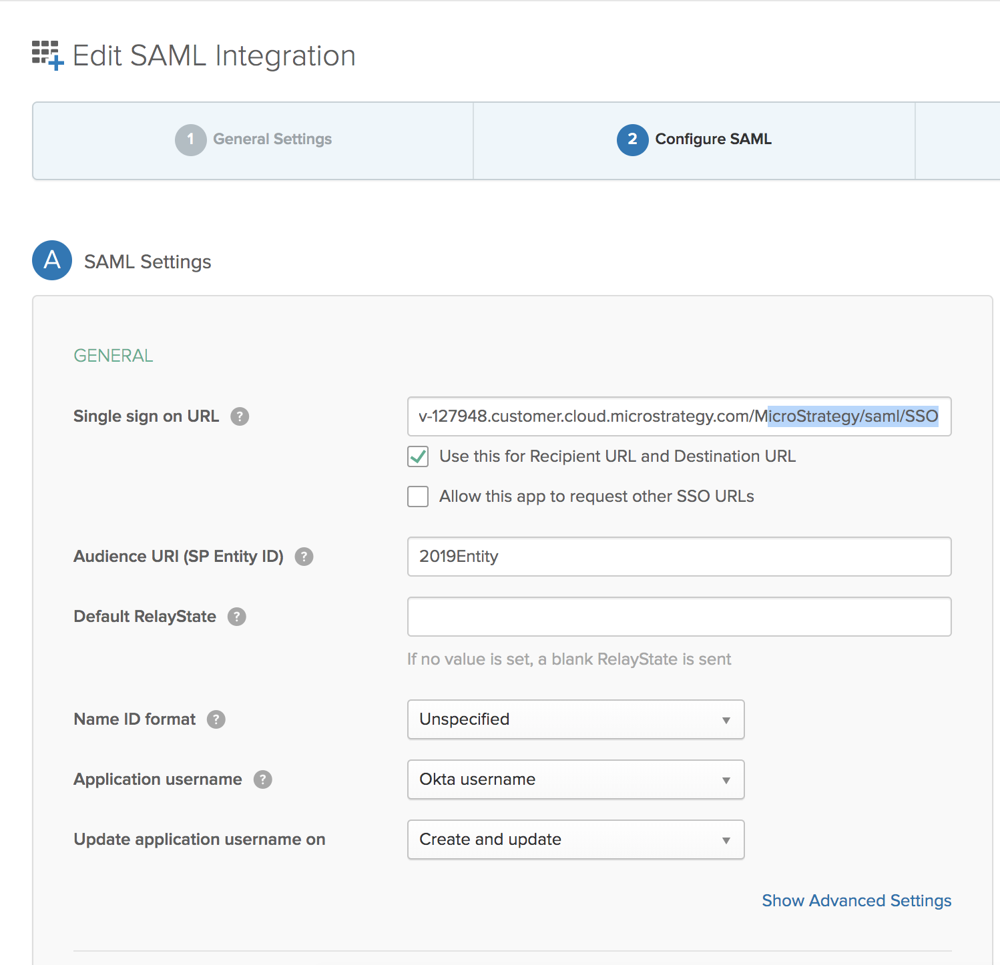

9)	Click through the rest of the menu options to complete the app registration.

10)	Download the Identity Provider metadata as `IDPMetadata.xml`

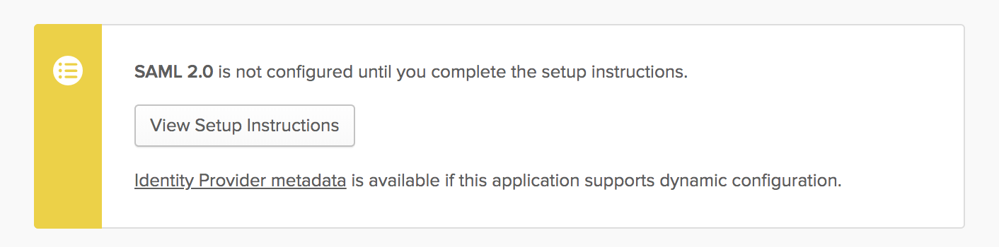

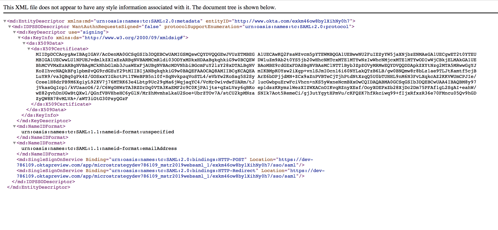

11) Upload this `IDPMetadata/xml` file to the SAML folder where the other config files were generated earlier:
`../WEB-INF/classes/resources/SAML/`

### Setup Trust Relationship between the Web and Intelligence Server
1) Go to the MSTR web admin page `https://[Webserver]/MicroStrategy/servlet/mstrWebAdmin`and click `modify` next to your desired Intelligence server.

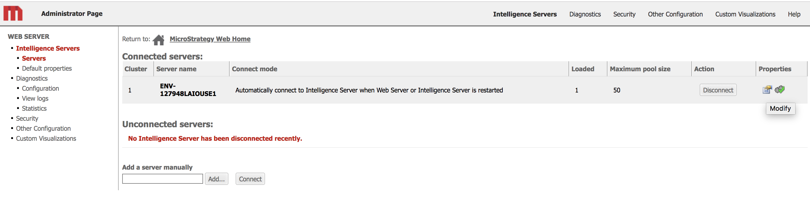

2) Go through the configuration steps to establish a trust relationship

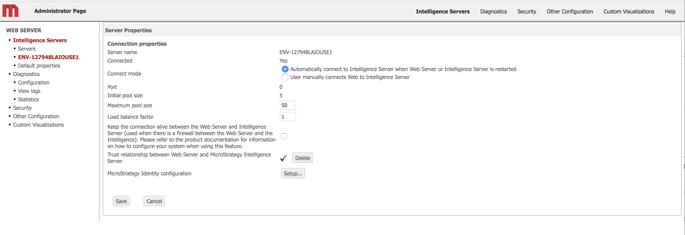

### Enable Trusted Authentication

1) In the same admin page, click on the `default properties` tab and ensure Trusted Authentication is enabled and set to default

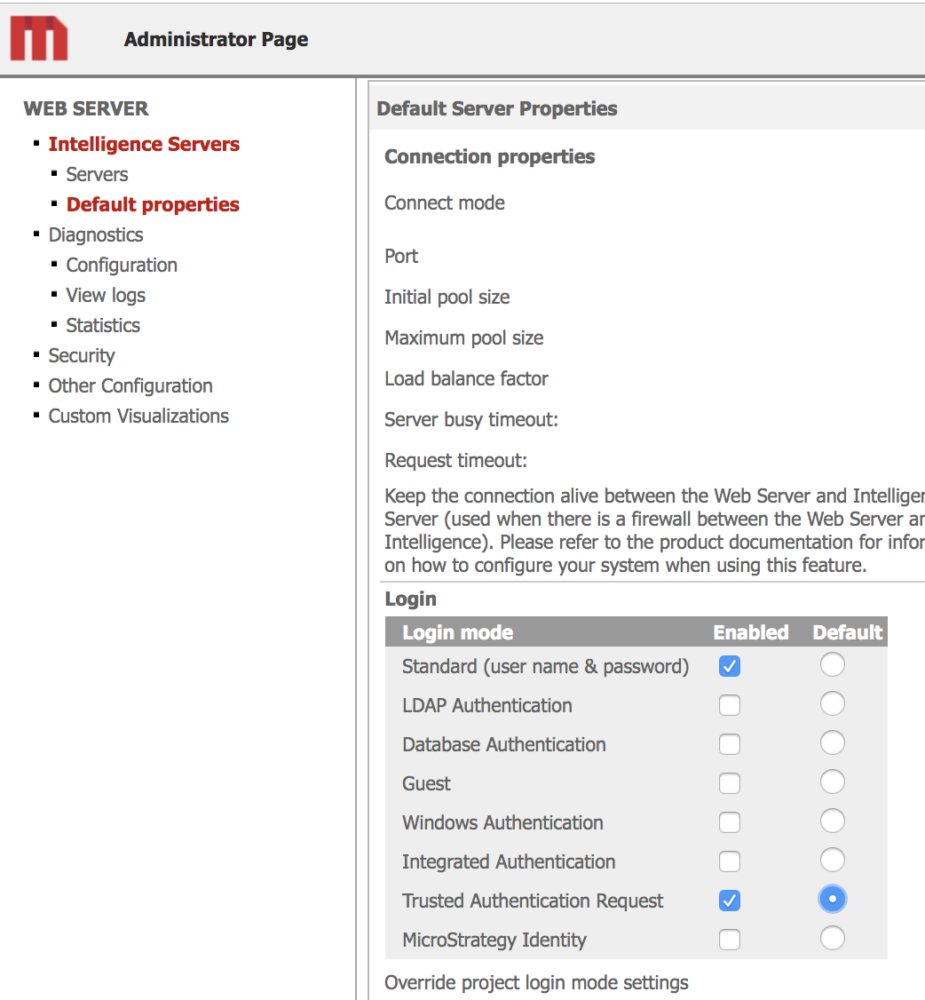

### Modify web.xml to leverage SAML authentication

1) Within the MicroStrategy Web Application directory, open the `web.xml` file in `/WEB-INF/`

2) Locate the line beginning with   `<!-- Uncomment fragment below to enable SAML Authentication mode` and uncomment the block
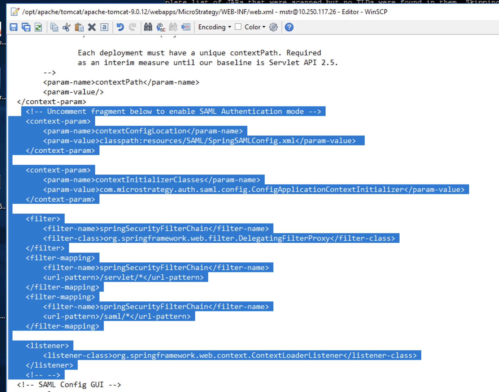

### Restart Web Server

Restart the webserver to finalize the process. 

You will no longer be able to access pages like the admin or SAML config page without authenticating against SAML. You may re-comment the section in the web.xml to reaccess these pages.

### Map OKTA user to MicroStrategy User

Unless you change the import settings for SAML, the authentication will fail because MicroStrategy will not find a user with a trustID that matches the NameID provided by the SAML assertion. To quickly test this:

1) Open MicroStrategy Developer
2) Edit a user with web access
3) Under Authentication > Metadata, ensure that the OKTA user's email is set as the TrustID for a MSTR user (By default, the SAML Assertion will set the NameID as the Okta users email address)

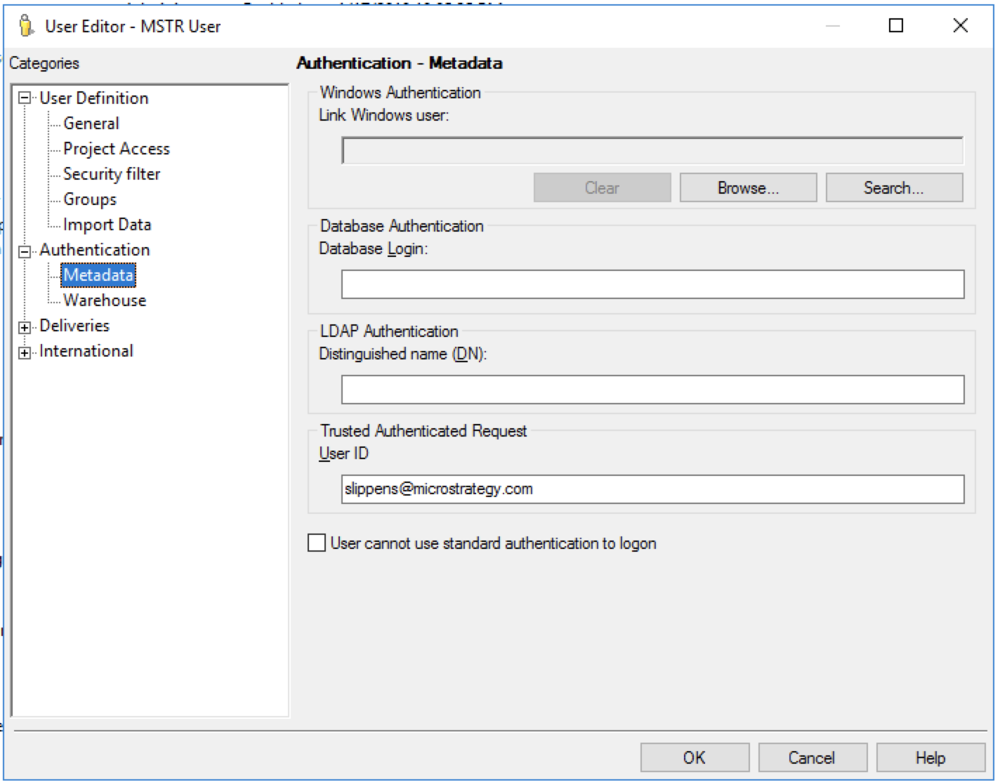

### Official Documentation:
This example is a bare-bones example of a SAML deployment, and there are many additional configuration options available. Please refer to the official documentation for more details.
https://www2.microstrategy.com/producthelp/current/SystemAdmin/WebHelp/Lang_1033/Content/enable_saml_for_library.htm
