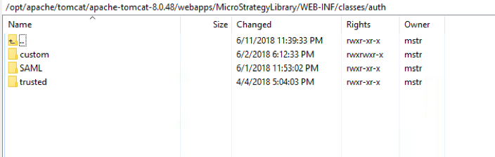
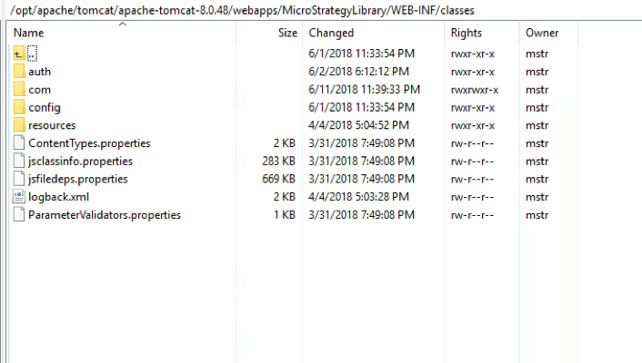

## Purpose

The purpose of this sample is to show how the authentication process for Library can be customized to accept a JWT Token to automatically log a user into the MicroStrategy system and show content embedded within your own application.

Additional features demonstrated:
* Automated user creation
* Automated user group assignment

## Workflow

For this particular engagement, the requirement was to:
* Take in a JWT token from the parent application
* Communicate with an internal server to decrypt/validate the JWT Token (NodeJS Server)
* Create the user if it already doesn't exist
* Assign the user to the groups defined by the JWT Token
* Seamlessly show the interactive MicroStrategy content without ever prompting for credentials

## Setup

### Download files

1. Download the files in this repository

### Extend the trusted authentication workflow
In order to consume a JWT Token for single sign-on, a customization must be added to the process in charge of handing the Trusted Authentication process. 
1.	Within the MicroStrategyLibrary web application directory, navigate to WEB-INF/auth
2.	Add the included `custom` folder package to this directory

Note – This custom folder contains an XML file that instructions MicroStrategyLibrary to leverage a custom class to handle the authentication process for trusted authentication. This class file will be deployed in the next steps.

3.	Within the MicroStrategyLibrary web application directory, navigate to WEB-INF/classes
4.	Add the included `com` folder package to this directory

Note – This com folder contains a sample custom class which was built to parse a JWT token provided as a body parameter to the API request and submit a trusted authentication request using the sub parameter within the JWT Token. The source of this class has been provided within the included `src` folder.

### Configure CORS settings (If hosting on another server other than the MicroStrategy Web server)
If the web application that will be embedding MicroStrategy content lives on a separate domain, the below steps must be performed to enable this communication
1. Go to the MicroStrategyLibrary admin page (`https://[webserver]/MicroStrategyLibrary/admin/webserver`) 
2. Under `Security Settings` check either `All` or `Specific` for the option to allow Library embedding in other sites. If you choose Specific you will need to explicity define the domains that have permission to embed the content.

### Enable Trusted Authentication for MicroStrategy Library
1.	Launch the MicroStrategy Library admin page
a.	https://WEBSERVERNAME/MicroStrategyLibrary/admin/webserver
2.	Check the option for Trusted and click save. 

### Deploy sample application
1.	Navigate to your webserver and deploy the provided index.html file  
2.	Edit the index.html file
3.	Alter the configuration parameters on lines 16-25, namely:
a.	Line 16 – Path to the embeddinglib.js in your environment (this is included in the MicroStrategy Library deployment)
b.	Line 19 – URL path to MicroStrategyLibrary
c.	Line 20 – The projectID the user should connect to
d.	Line 21 – The dossierID that should be rendered
e.	Line 25 – The JWT Token that will be used for SSO. A Sample JWT token is provided in the sample with the following definition: 

 
Note – The sub value is what the sample expects to be mapped to a MicroStrategy user, which will be done in the next steps.

### Configure MicroStrategy user for Trusted Authentication
1.	Open MicroStrategy Developer
2.	Edit a user and go to the Authentication tab
3.	Set the User ID that matches the sub parameter from the JWT token. The sample value is 1234567890 
  

### Restart the webserver for all changes to take place
1.	Restart Webserver

### Run sample index.html file to see the embedded content.

