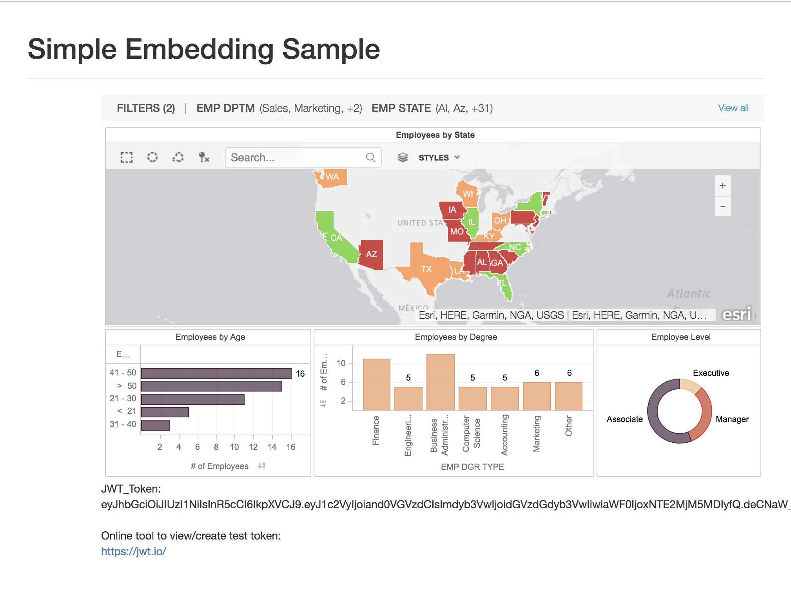
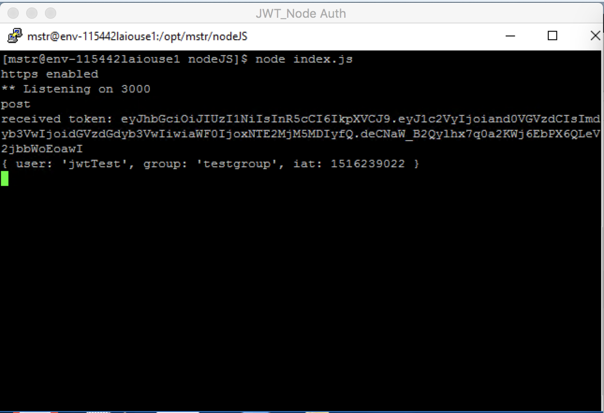
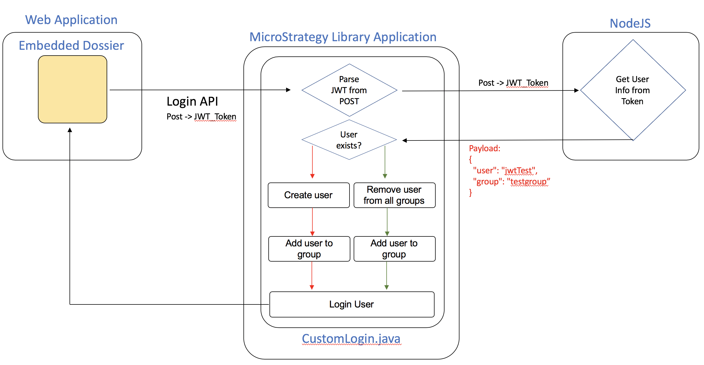
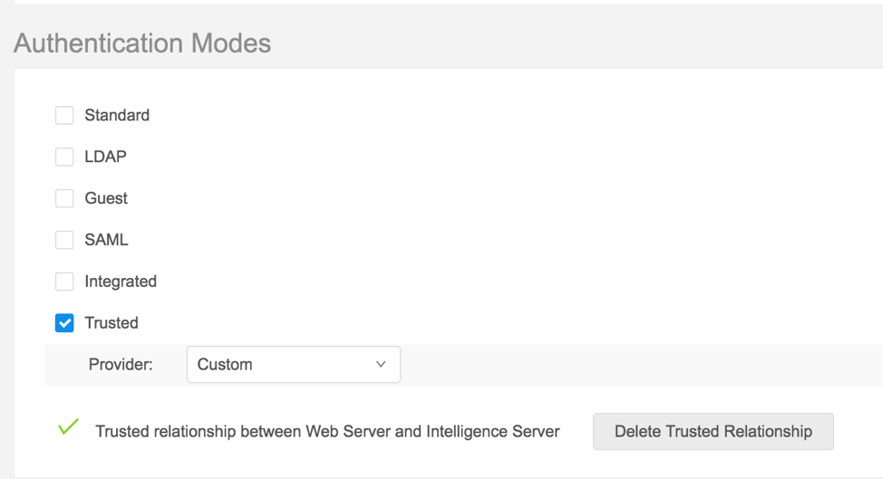
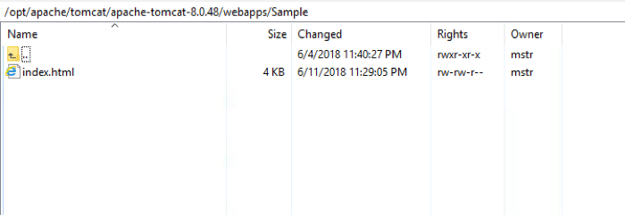
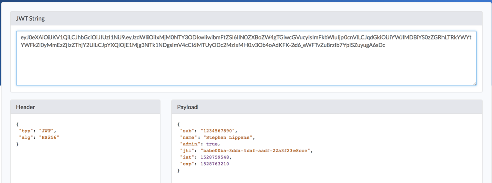
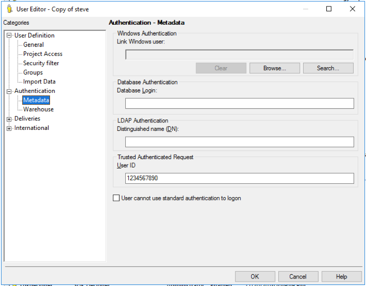

## Purpose

The purpose of this sample is to show how the authentication process for Library can be customized to accept a JWT Token to automatically log a user into the MicroStrategy system and show content embedded within your own application.

Features of this customization are:
* Accept JWT token from parent application
* Pass JWT to external system for validation (NodeJS server) `Not required, but was part of the requested POC workflow`
* Automatically create users if they do not already exist, based on JWT token parameters
* Automatically assign the user to the desired user groups based on JWT token parameters

## Workflow

## Setup

### Download files

1. Download the files in this repository and deploy them to your webserver. If using Tomcat, you can create a new folder called `EmbeddingSample` under the `webapps` directory and place all the files in this new folder.

### Deploy sample MSTR File

1. Go to MicroStrategy Web and upload the sample dossier (`SampleDossier.mstr` file) by clicking on Create > Upload MSTR File

Note - You can also use your own created dossier, but please note the filtering components of this sample were built to leverage multi-select-enabled attribute element selectors. 

### Modify the config files for your environment

1. Open the `config.js` file and set the various parameters according to your environment

The projectID can be obtained by right clicking on the desired project in Developer.
The DossierID can be obtained by right click > properties on the desired dossier in Web or Developer

### Configure CORS settings (If hosting on another server other than the MicroStrategy Web server)

1. Go to the MicroStrategyLibrary admin page (`https://[webserver]/MicroStrategyLibrary/admin/webserver`) 
2. Under `Security Settings` check either `All` or `Specific` for the option to allow Library embedding in other sites. If you choose Specific you will need to explicity define the domains that have permission to embed the content.

### Run Sample
If deployed to a webserver (like Tomcat), and you used the naming conventions in the sample instructions, the sample can be accessed at the URL:
`http(s)://[Webserver]/EmbeddingSample/index.html`
