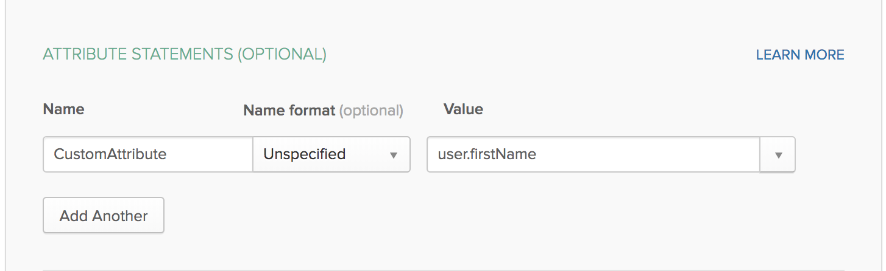
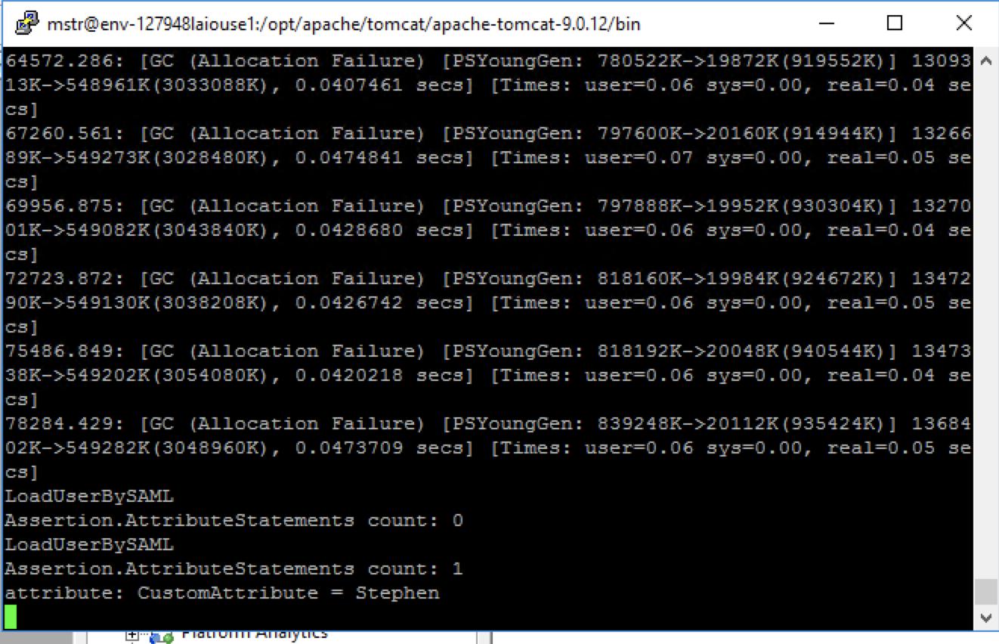
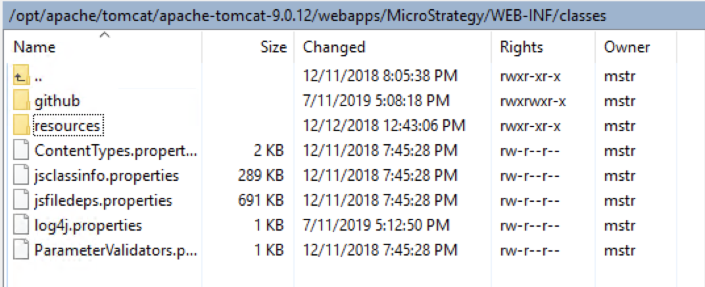
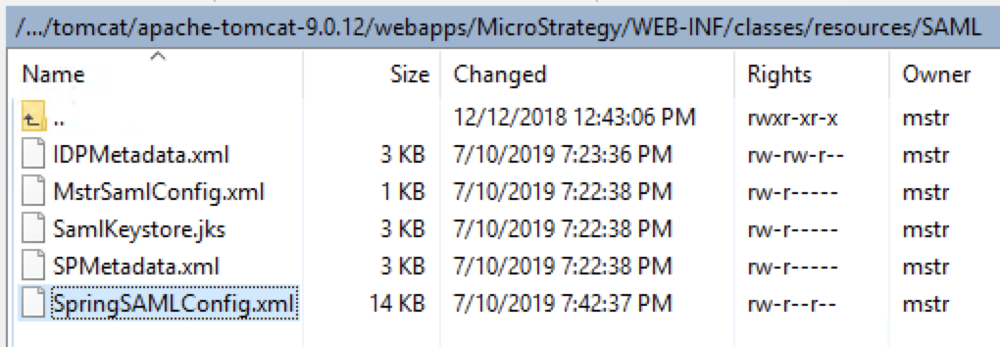
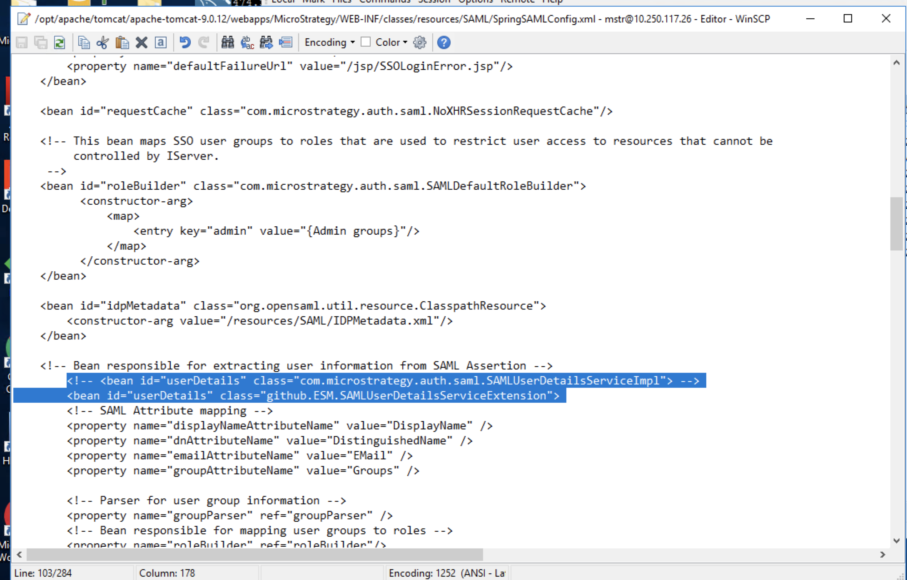

## Purpose

The purpose of this sample is to show how to extend the class responsible for obtaining the SAML Assertion parameters, giving developers a hook to add custom logic to the SAML authentication workflow for MicroStrategy Web

 

## Setup

### Prerequisites
1. Secure MicroStrategy Web with a SAML provider (IDP). An example of this can be found in this repository under the sample `1) SAML authentication for Web (OKTA)`

### Add custom SAMLUserDetailsServiceImpl class to classes folder
1. Download the provided class package from this repository (the folder `github`).
2. Upload this package to your MicroStrategy Web application under the path `../WEB-INF/classes/

The provided sample class will simply output all they assertion attribute names and values to the console. It is possible to further extend this by leveraging the MicroStrategy Web Java SDK to then perform custom logic as needed based on the attributes provided.

The source to this example is provided in the `src` folder of this repository

### Modify SpringSAMLConfig.xml file
During the SAML configuration process, a number of files were generated within the MicroStrategy Web application under the path `../WEB-INF/classes/resources/SAML/`, one of which being the `SpringSAMLConfig.xml` file.

1) Edit `SpringSAMLConfig.xml`
2) Locate the line `<bean id="userDetails" class="com.microstrategy.auth.saml.SAMLUserDetailsServiceImpl">`
3) Edit the class definition to point to the custom class that we moved to the classes folder. In our example, the altertion should be `<bean id="userDetails" class="github.ESM.SAMLUserDetailsServiceExtension">`

### Restart the Web Server

1. Restart the web server to have the changes take effect. Performing a SAML authentication will now output any assertion attribute and their associated values to the console.

### Official SAML Documentation:
https://www2.microstrategy.com/producthelp/current/SystemAdmin/WebHelp/Lang_1033/Content/enable_saml_for_library.htm
