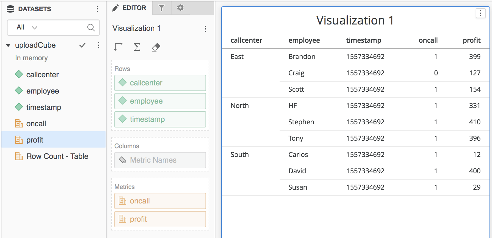
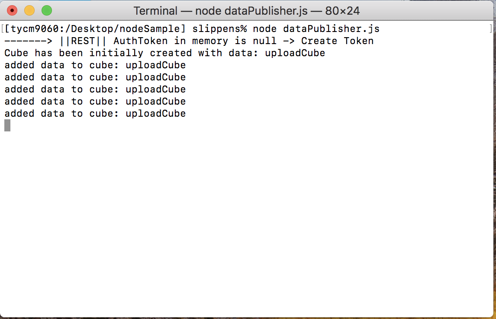

## Purpose

The purpose of this sample is to show how to use the REST API to push external data into MicroStrategy. The sample generates random callcenter data every 5 seconds and sends the updated data to MicroStrategy and utilizes:
* login API for session creation
* Session validation to reuse valid sessions or recreate when expired
* Search API to locate if the desired cube exists (and needs to be updated), or doesn't exist and needs to be initially created

The sample is written as a NodeJS application which could be easily extended to solve solutions in production-ready environments. 

## Setup

### Download files

1. Download the files in this repository and deploy them to your computer. 

### Modify the config files for your environment

1. Open the `config.js` file and set the various parameters according to your environment

### Configure CORS settings (If hosting on another server other than the MicroStrategy Web server)

1. Go to the MicroStrategyLibrary admin page (`https://[webserver]/MicroStrategyLibrary/admin/webserver`) 
2. Under `Security Settings` check either `All` or `Specific` for the option to allow Library embedding in other sites. If you choose Specific you will need to explicity define the domains that have permission to embed the content.

### Run Sample
The sample is written for NodeJS, so you will first want to make sure you have Node installed. `node -v` will validate if you have node installed.

The sample can be run by navigation to the sample and running the command `node dataPublisher.js`

## Additional Documentation
https://lw.microstrategy.com/msdz/MSDL/GARelease_Current/docs/projects/RESTSDK/Content/topics/REST_API/REST_API_PushDataAPI_MakingExternalDataAvailable.htm

