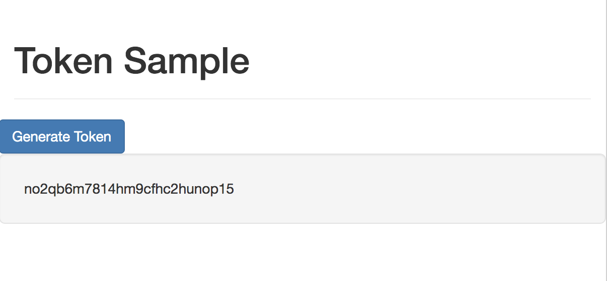

## Purpose

The purpose of this sample is to show how to use the REST API to create an authToken. The authtoken represents a valid, active session with the MicroStrategy analytics platform. Data accessed and actions taken are controlled based on what privileges and roles the authenticated user is assigned. 

Once an authToken is obtained, it can be used to make subsequent API calls.





## Setup

### Download files

1. Download the files in this repository and deploy them to your webserver.

### Modify the config files for your environment

1. Open the `config.js` file and set the various parameters according to your environment

```javascript
{
	"host":"env-XXXXXX.customer.cloud.microstrategy.com", //webserver hosting the MicroStrategy Library application
	"username":"username",  //your username
	"password":"password", //your password
}
```

### Run Sample
Run the html sample from your webserver. If the sample seems to fail, run the sample with (browser) developer tools running to view potential errors in the console. Odds are that the credentials provided were incorrect or you are running on a non SSL secured environment (this can be fixed by switching the code to use HTTP).


## Additional Documentation
https://lw.microstrategy.com/msdz/MSDL/GARelease_Current/docs/projects/RESTSDK/Content/topics/REST_API/REST_API_Workflow_Authentication.htm

