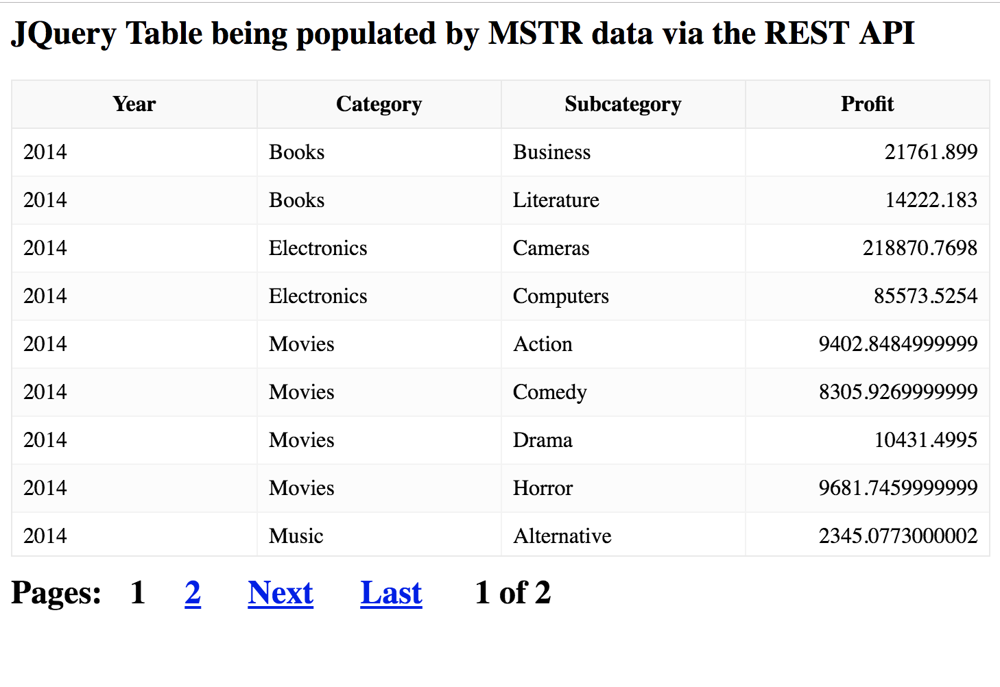

## Purpose

The purpose of this sample is to show how to use the REST API to push extract datasets (from either in-memory cubes or reports) which can then be rendered by a 3rd party UI. While MicroStrategy provides a number of ways to build interactive UIs in the form of dashboards, it is sometimes desirable to leverage a 3rd party platform to achieve the wanted look and feel. The JSON Data API allows developers to query data from MicroStrategy and return it in a JSON format. 

This sample takes the JSON payload from MicroStrategy and transforms it to be loaded into a JQuery table visualization.




## Setup

### Download files

1. Download the files in this repository and deploy them to your webserver.

### Modify the config files for your environment

1. Open the `config.js` file and set the various parameters according to your environment

```javascript
{
    "projectID": "B7CA92F04B9FAE8D941C3E9B7E0CD754",
    "username" : "user",
    "password": "password",
    "webserver" : "https://env-XXXXXX.customer.cloud.microstrategy.com", 
    "reportID" : "59F53DBC11E93B7235C50080EFE54414",
}
```

### Run Sample
Run the html sample from your webserver. If the sample seems to fail, run the sample with (browser) developer tools running to view potential errors in the console. Odds are that the credentials provided were incorrect or you are running on a non SSL secured environment (this can be fixed by switching the code to use HTTP).


## Additional Documentation
https://lw.microstrategy.com/msdz/MSDL/GARelease_Current/docs/projects/RESTSDK/Content/topics/REST_API/REST_API_JSONDataAPI_Workflow.htm

