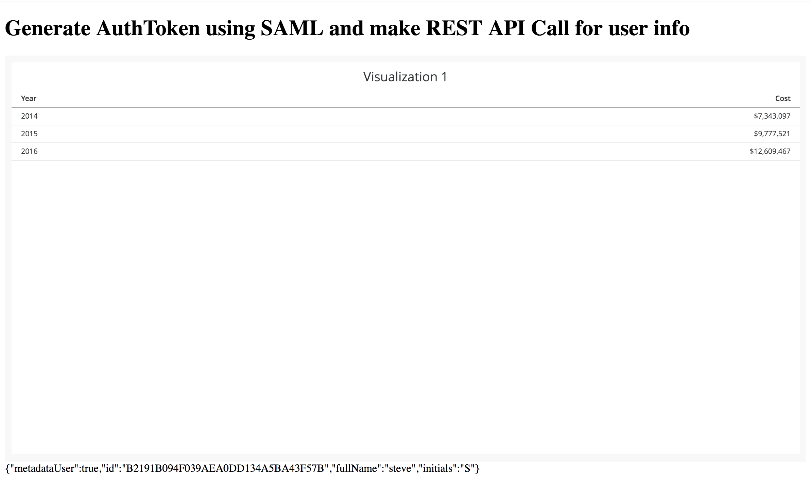
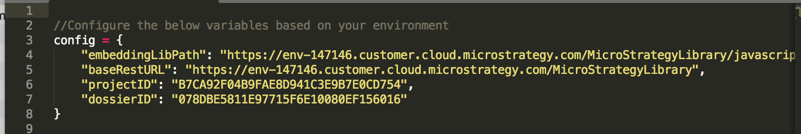

## Purpose

The purpose of this sample is to show how to obtain an AuthToken when using SAML authentication so that applications can access the token to make additional API calls using the REST API. 

 

Since SAML requires a browser redirect, the workflow is:
1) Either:
  a) Embed a dossier using the JS Embedding API, or
  b) Create an iframe which will run the SAML SSO url
2) Upon success, access the cookie that is generate and extract the authToken
3) Make desired API call

This sample will leverage the first possible workflow by first attempting to render a Dossier. We then obtain the current session being used by the embedding API to allow us to take further action using the REST API. This sample is appropriate for those who want to both show embedded content and also take advantage of the REST API. if only the REST API is needed, please look at the other REST API with SAML sample provided in this repository. 

This sample calls the (GET) /sessions/userInfo API and prints the API response on the bottom of the screen.

## Setup

### Prerequisites
1. Secure MicroStrategy Web with a SAML provider (IDP). An example of this can be found in this repository under the sample `SSO and Custom Security/1) SAML authentication for Web (OKTA)`

### Deploy Sample code to web server
1. Download the `SAML_REST_SAMPLE` folder and deploy to web server
2. Open the `config.js` file and edit the parameters to reflect your environment

### Run Sample
Run the sample by running the .html file in your browser. If the files names were kept the sample, it should be accessible at the following URL:
`https://[WEBSERVER]/SAML_REST_SAMPLE/index.html`

 

### Official SAML Documentation:
https://www2.microstrategy.com/producthelp/current/SystemAdmin/WebHelp/Lang_1033/Content/enable_saml_for_library.htm
