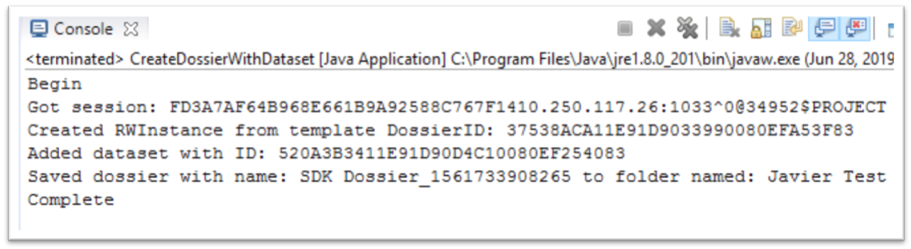
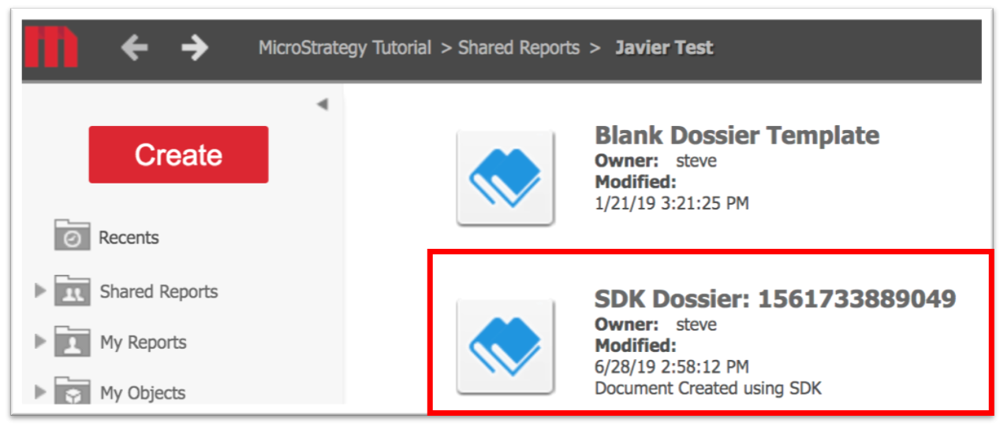
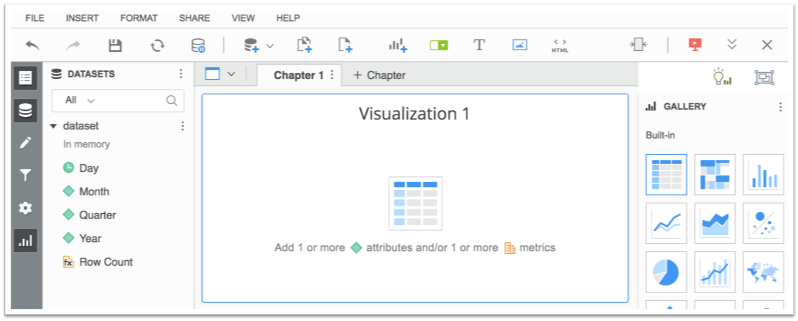
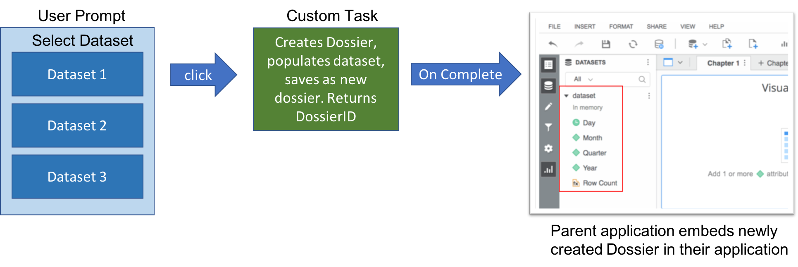

### Purpose

Run code to create dossier with an included dataset



Access newly created dossier in web



Run analysis with dataset already available



This sample shows how to create and save a dossier with a dataset already associated with it. Typically, users need to manually select which datasets they would like to analyze when creating a brand new Dossier.

This sample was developed for a customer who wanted to create an external portal that provided the end user a list of available datasets which the user could then click on to immeidately be brought to a dossier loaded with the appropriate data. In order to accomplish this, this standalone code was then converted to a task (webservice) so that it could be invoked using an HTTP request. This task can be found within my task samples.




### Prerequisites

1) Import MSTR JARs into desired JAVA IDE.
The Web SDK consists of a number of java packages that are included in the installation/deployment of the MicroStrategy Web application. You can also download a copy of the MSDL which contains all the libraries at the link below:
https://lw.microstrategy.com/msdz/MSDL/GARelease_Current/docs/projects/WebSDK/Content/topics/DownloadableWebSDKZipFile.htm

Using Eclipse (or your preferred java IDE), import the MSTR packages to begin using the Web SDK.

### Setup 

1) Download the java sample and import into your preferred IDE
2) Create a new dossier, immediately save it with no modifications, and record its GUID (In Web: Right click -> Properties)
2) Modify the configuration parameters `lines 24-33` to reflect your environment

```java
  static String server_name = "XXX.XXX.XXX.XXX"; //IP or FQDN for MSTR Intelligence Server
	static int server_port = 0; //MSTR Intelligence Server Port
	static String project_name = "MicroStrategy Tutorial"; //Project to create session for
	static String username = "myUser"; //MSTR Username
	static String password = "myPass"; //MST Password
	
  //Cannot create dossier from scratch. To work around   this, we can create and save a 100% empty dossier and use it as a      template by duplicating it then performing manipulations
	static String dossierTemplateID = "37538ACA11E91D9033990080EFA53F83";  
	static String datasetID = "520A3B3411E91D90D4C10080EF254083"; //Dataset to add to dossier
	static String saveFolderID = "2339722A11E91D90091D0080EF8580D3"; //folder to save newly manipulated dossier
	static String saveName = "SDK Dossier_" + System.currentTimeMillis(); //Name to save new dossier as
  ```


4) Compile and run the sample
  


# Documentation
https://lw.microstrategy.com/msdz/MSDL/GARelease_Current/docs/projects/WebSDK/Content/topics/other/Introduction_to_the_Web_SDK.htm
