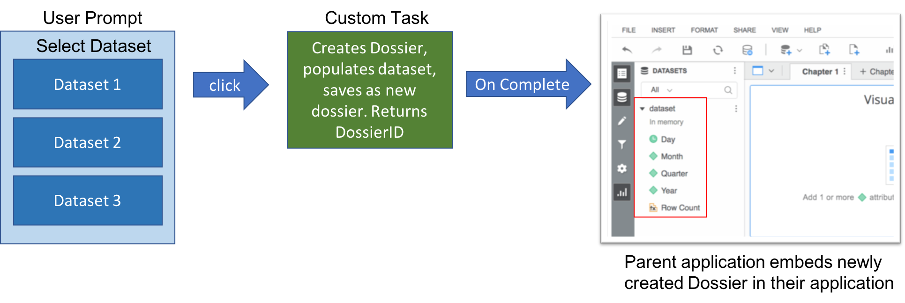
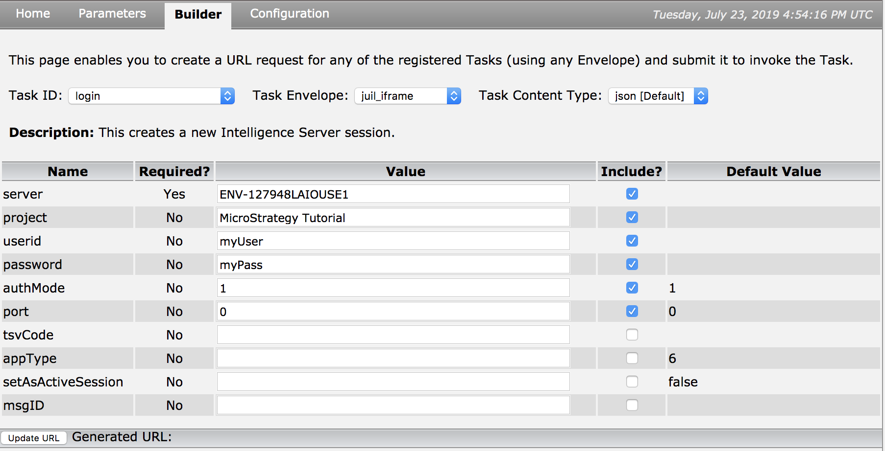
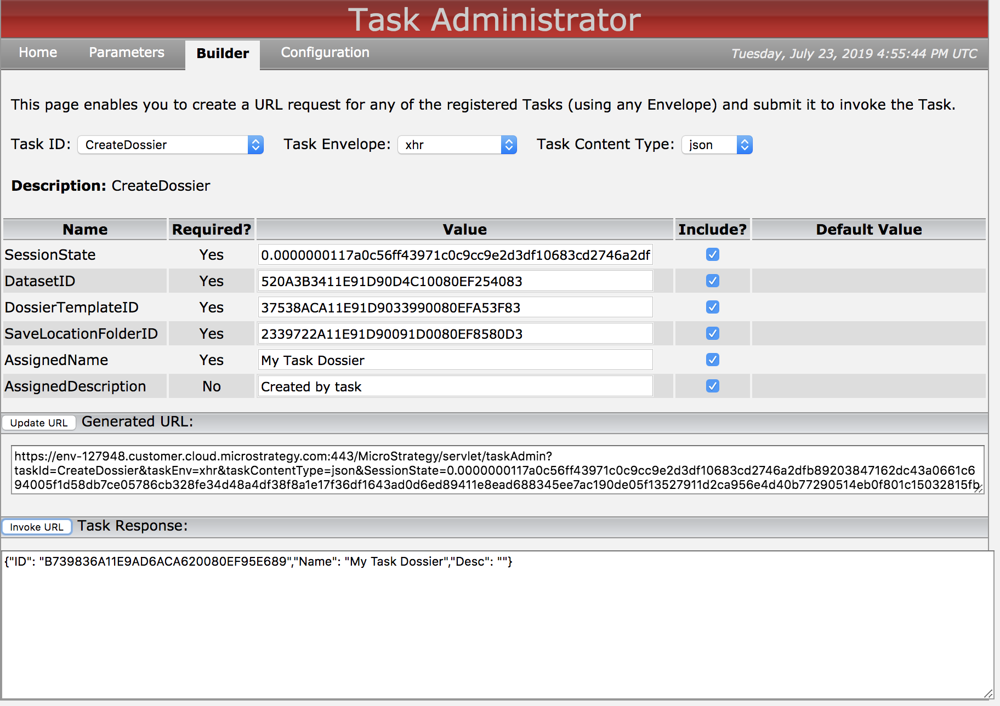
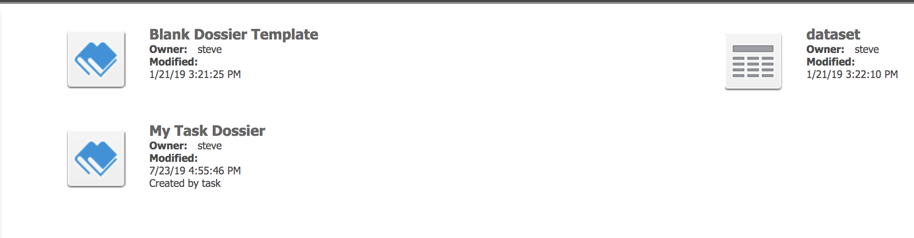

### Purpose


This sample shows how to create and save a dossier with a dataset already associated with it. Typically, users need to manually select which datasets they would like to analyze when creating a brand new Dossier.

This sample was developed for a customer who wanted to create an external portal that provided the end user a list of available datasets which the user could then click on to immeidately be brought to a dossier loaded with the appropriate data. In order to accomplish this, this standalone code was then converted to a task (webservice) so that it could be invoked using an HTTP request. This task can be found within my task samples.




This sample is the standalone java code which creates the dossier itself. If you would like to see the Task (Webservice) deployment of this code, please check the `Custom Tasks` section of this repository

### Code Explanation

The underlying java SDK behind this task is explained in an example under the `Standalone Java SDK` samples section of this repository. The provided plugin wraps this sample as a task which is invokable via an HTTP request to systems outside of the java runtime environment.

The java source behind this task is included in the `src` folder of this repository.

### Setup 

1) Download the `dossierCreationTask` plugin

2) Deploy the plugin in the `plugins` folder within your MicroStrategy Web application.
`../MicroStrategy/plugins/`

3) Restart the webserver for the changes to take place
  
4) Create and save a new empty dossier (which we will use as a template). Since we cannot create a new dossier from scratch, we will access an empty existing dossier, modify it, and save it as a new dossier. Once saved, take note of the DossierID which you can get by right click > properties through the developer or web interface.
  
  ### Usage
  1) Access the taskAdmin servlet
  `https://[WEBSERVER]/MicroStrategy/servlet/taskAdmin?pg=builder`
  
  2) In the dropdown list, locate the `login` task and enter your environment parameters to generate a sessionState
  
  
  
  3) In the dropdown list, locate the newly created task `CreateDossier` and fill out the parameters:
  
  
  
  
  ```
  SessionState: session token generated by the `login` task

  DatasetID: GUID of dataset that should be added to the Dossier
	
  DossierTemplateID: GUID of the template dossier created in step 4 of the `Setup` section
	
  SaveLocationFolderID: GUID of the folder where the newly created Dossier should be saved to
	
  AssignedName: Name to save the Dossier as
	
  AssignedDescription: Description to save Dossier with
```
  
  The task will return the newly created dossier ID which could then be used by an external application to directly display this dossier to the end user.
  
  
 
 
 The exeuction will end up saving a new dossier in the folder location of your choice based on the task parameters. This taskURL can now be invoked by any application.

  

# Documentation
Information on how to create and deploy a custom task
https://lw.microstrategy.com/msdz/MSDL/GARelease_Current/docs/projects/WebSDK/Content/topics/webcusteditor/custtasks/WCE_Creating_a_New_Java-based_Task.htm
