## Purpose

The purpose of this sample is to show how to create an Alexa Skill that is able to ask questions against a dataset contained within MicroStrategy. This particular sample utlizes in-memory cube datasets, but it can be easily modified to pull against report datasets as well. 

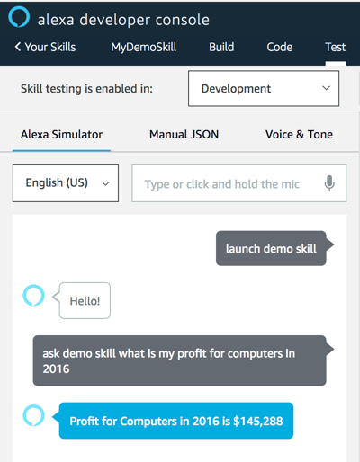

## Setup

### Prepare the data within MicroStrategy

1. Import the included dataset.xlsx file as a cube

   In MicroStrategy Web `Create > Add External Data`
  
   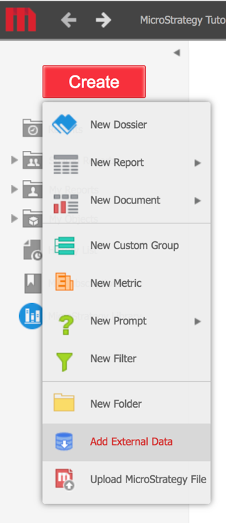
  
2. Click finish and save cube.

  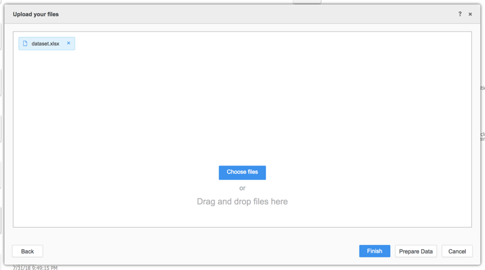
  
3. Right click on the created cube and go to properties to get the cube ID

    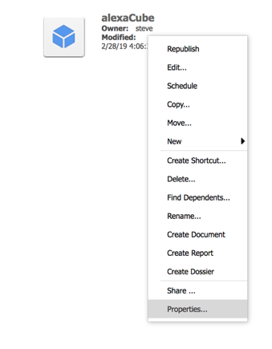
        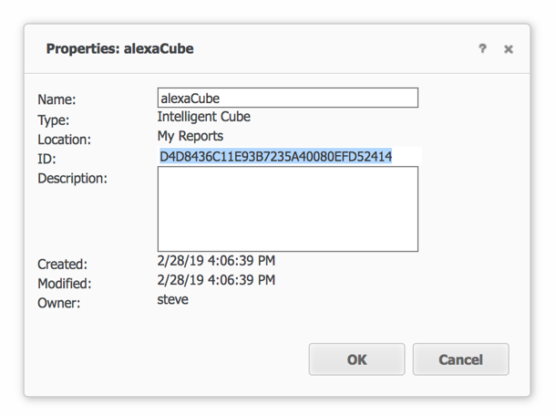

### Create the Alexa Skill

1. Go to https://developer.amazon.com/alexa
2. Click on ‘Skill Builders’ and click ‘Start a skill’
 
     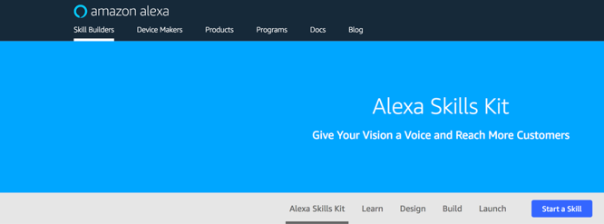

3. Click `Create Skill` in the top right corner
4. Select `Custom Skill`, fill out a skill name, and click `Create Skill` in the top right corner.
     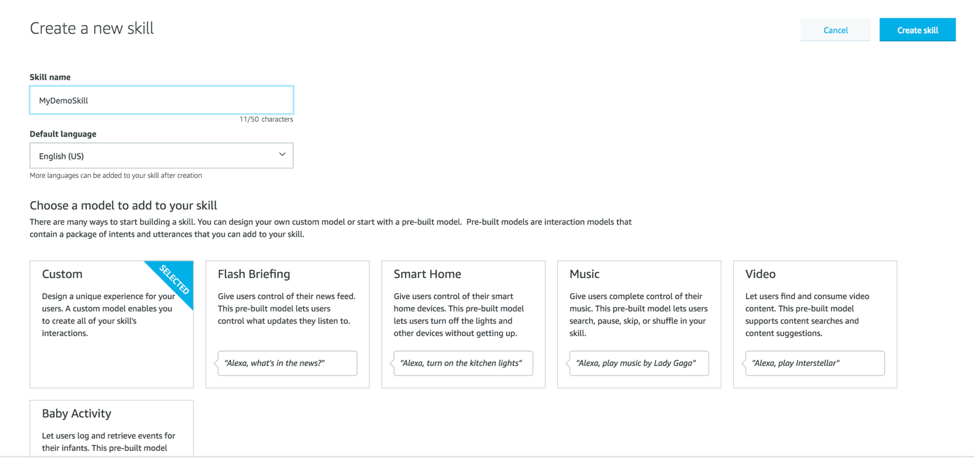
     

5. For the template, select `Start From Scratch`. 
 

6. On the left panel, click `JSON Editor` and paste in the contents from the **skill.json** file included in this repository.
      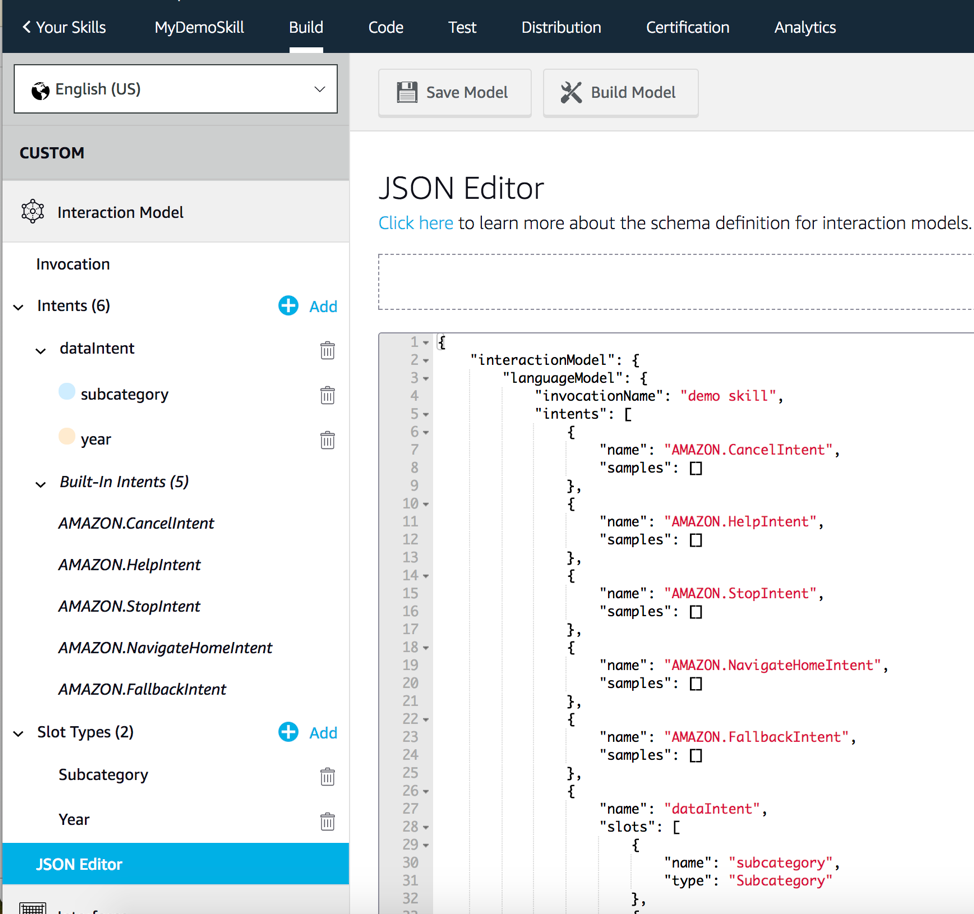

Click `Save Model` and then `Build Model`. This process may take a few minutes to complete. A popup will appear when finished.

### Create the Lambda Endpoint

1. Download the `MyDemoLambdaSkill.zip` file from this repository 
2. Upload the lambda function to your AWS Account

#### Note: 
AWS keeps changing how/where you can upload lambda functions so I am leaving this section to you. Find the appropriate process (using CLI, or some other method) to upload the lambda function to your environment.

3. Modify the Config object defined on line 5 with information from your own MicroStrategy environment. (You will need to use Desktop or the REST API to obtain your project ID, the other IDs can be obtained through web).
       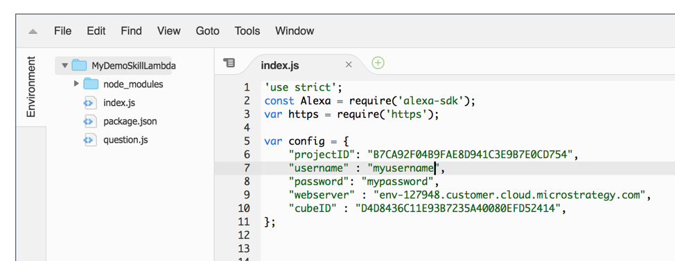

4. Copy the ARN for the lambda function shown in the top right corner
        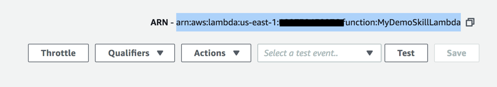

### Add Lambda endpoint to Alexa Skill

1. Go back to the Alexa Skill, click on the `endpoint` section on the left, and provide your ARN as the default region value.
        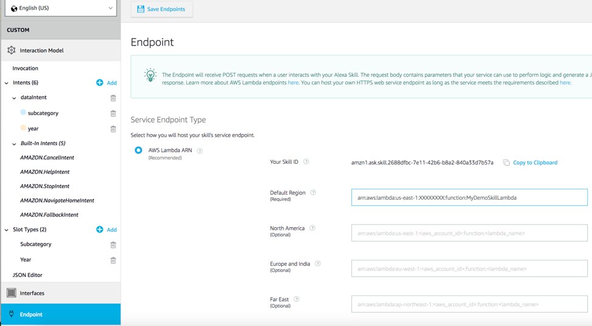
 
2. Click `Save Endpoints` on the top of the screen

### Skill Testing

1. On the top menu, click `test` and set skill testing enabled for `Development`.
        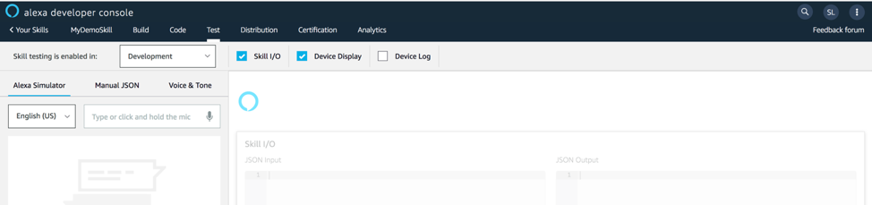
 
2. The launch request was hardcoded to respond ‘hello’. Try typing `Launch demo skill` to see if everything was setup properly
        
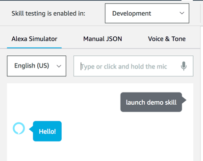

3. Next, let’s try asking a question on the data. 
`Ask demo skill what is my profit for computers in 2016`
         
 

You can try various combinations of subcategory elements and years present in the sample dataset.

### additional info
You can test this on a physical alexa device by simply logging into the device with the amazon account that developed the skill (as long as you set the skill as in development). 
