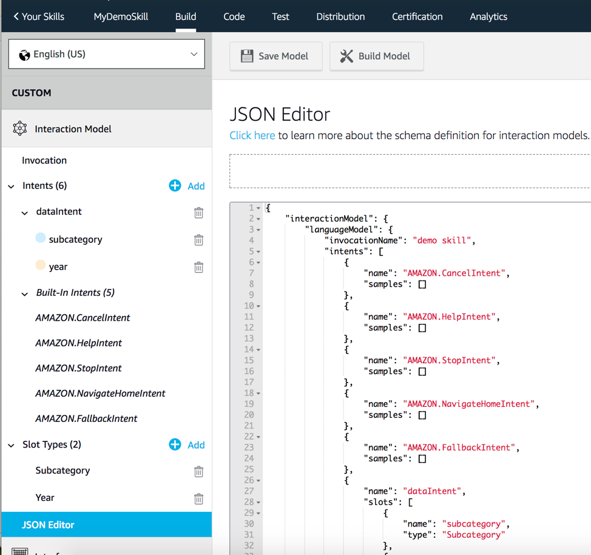
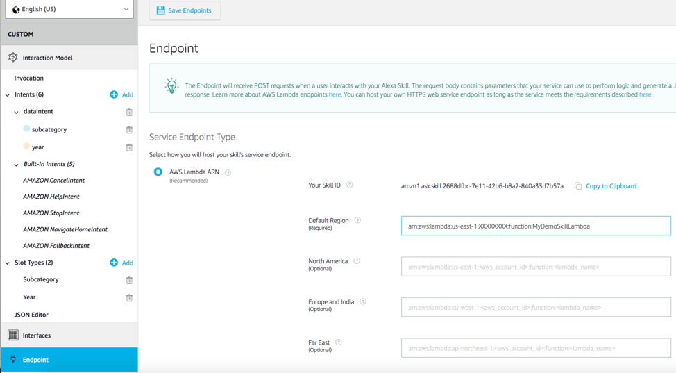

## Purpose

The purpose of this sample is to show how to create an Alexa Skill that is able to ask questions against a dossier designed within MicroStrategy. This skill allows you to define a visualization with a metric value which will be read aloud to the user if they say the phrase defined as the visualizations title.

In this scenario, the intent was defined as:

Ask Dashboard to tell me _________ 

The blank will look for a match on the visualization title, such as `about cost` or `about revenue`

## Setup

### Import sample Dossier into your environment

1. Go to MicroStrategy Web and upload the sample dossier (`Alexa Dossier.mstr` file) by clicking on Create > Upload MSTR File

### Create the Alexa Skill

1. Go to https://developer.amazon.com/alexa
2. Click on ‘Skill Builders’ and click ‘Start a skill’
 
     

3. Click `Create Skill` in the top right corner
4. Select `Custom Skill`, fill out a skill name, and click `Create Skill` in the top right corner.
     
     

5. For the template, select `Start from scratch`

6. On the left panel, click `JSON Editor` and paste in the contents from the **skill.json** file included in this repository.
      

Click `Save Model` and then `Build Model`. This process may take a few minutes to complete. A popup will appear when finished.

#### NOTE
The invocation name is currenty set to `dashboard`. This value can be changed by clicking on the `invocation` tab on the left.

Also, this skill is able to capture the entirety of your spoken phrase by using Amazons `search query` slot type. This unique slot type requires a leading phrase. In this example, 2 leading phrases were created for you:

1) What is ________
2) Tell me ________

You will want to create the possible leading phrases your end users can say to trigger the dossier title lookup (and you will want to leave these leading phrases out of the title themselves. See the first screenshots on the top of this readme for an example). 

You can edit these phrases in the `intents` tab
    

### Create the Lambda Endpoint

1. Download the lambda.zip file from this repository 
2. Upload the lambda function to your AWS Account

#### Note: 
AWS keeps changing how/where you can upload lambda functions so I am leaving this section to you. Find the appropriate process (using CLI, or some other method) to upload the lambda function to your environment.

3. Modify the Config object defined on line 12 with information from your own MicroStrategy environment. (You will need to use Desktop or the REST API to obtain your project ID, the other IDs can be obtained through web).
       

10. Copy the ARN for the lambda function shown in the top right corner
        

### Add Lambda endpoint to Alexa Skill

1. Go back to the Alexa Skill, click on the `endpoint` section on the left, and provide your ARN as the default region value.
        
 
2. Click `Save Endpoints` on the top of the screen

### Skill Testing

1. On the top menu, click `test` and set skill testing enabled for `Development`.
        
 
2.  Try typing `Ask dashboard to tell me about revenue` to see if everything was setup properly
        

### additional info
You can test this on a physical alexa device by simply logging into the device with the amazon account that developed the skill (as long as you set the skill as in development). 
