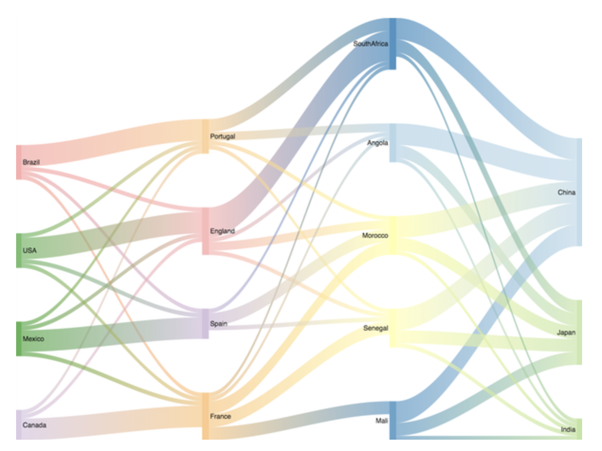

# Visualization SDK

The visualization SDK allows developers to create and deploy their own visualizations for use within MicroStrategy dashboards. The SDK provides APIs to obtain the data for your visualization and a number of other features to let you design interactive visualizations based on your unique needs.

# Documentation
https://lw.microstrategy.com/msdz/MSDL/GARelease_Current/docs/projects/VisSDK/Content/topics/Introduction_to_the_Visualization_SDK.htm
