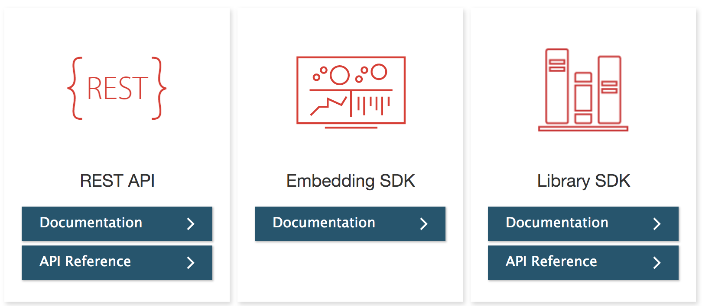
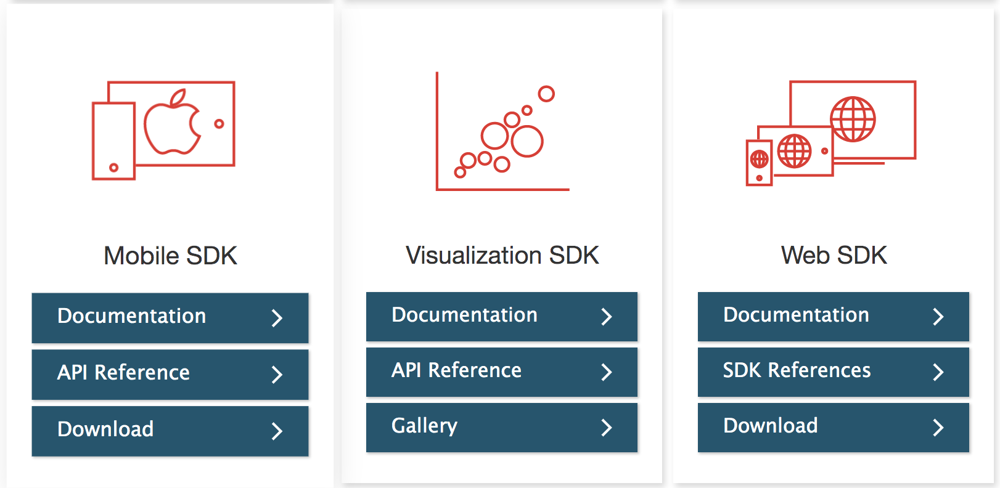

# Introduction

My name is Stephen Lippens, and I've been working with MicroStrategy and its API toolkits since 2010. My goal is to port over all the code samples and projects I've created over the years into this master repository. Downloading this single repository will give you access to a wide variety of samples touching on all the various SDKs available.

## Documentation

Documentation for the various SDKs and APIs MicroStrategy offers can be found at the below link:
https://developer.microstrategy.com

## Contact

https://www.linkedin.com/in/stephenlippens/

